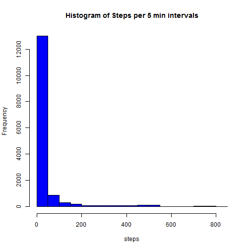
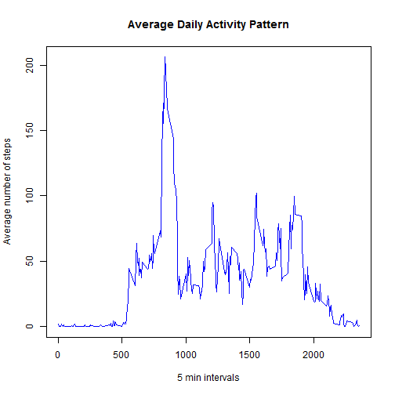

# Reproducible Research: Peer Assessment 1


## Loading and preprocessing the data


```r
stepinfo<-read.csv("activity.csv")
```


## What is mean total number of steps taken per day?


```r
hist(stepinfo$steps,col="blue",main=paste("Histogram of Steps per 5 min intervals"),xlab="steps")
```

 

```r
meanstep<-mean(stepinfo$steps,na.rm=TRUE)
medstep<-median(stepinfo$steps,na.rm=TRUE)
cat("The mean number of sets is ",meanstep," and the median number is ",medstep,".")
```

```
## The mean number of sets is  37.38  and the median number is  0 .
```


## What is the average daily activity pattern?


```r
meanpattern<-tapply(stepinfo$steps,as.factor(stepinfo$interval),mean,na.rm=TRUE)
int<-unique(stepinfo$interval)

plot(int,meanpattern,type="l",col="blue",
      main="Average Daily Activity Pattern",xlab="5 min intervals",
      ylab="Average number of steps")
```

 

```r
most<-max(meanpattern)
histep<-sum((most==meanpattern)*int)
cat("The interval with the greatest mean number of steps is ",histep,".")
```

```
## The interval with the greatest mean number of steps is  835 .
```


## Imputing missing values


```r
cat("The total number of missing values for Steps is",sum(is.na(stepinfo$steps)))
```

```
## The total number of missing values for Steps is 2304
```

```r
newinfo<-stepinfo
```


## Are there differences in activity patterns between weekdays and weekends?
